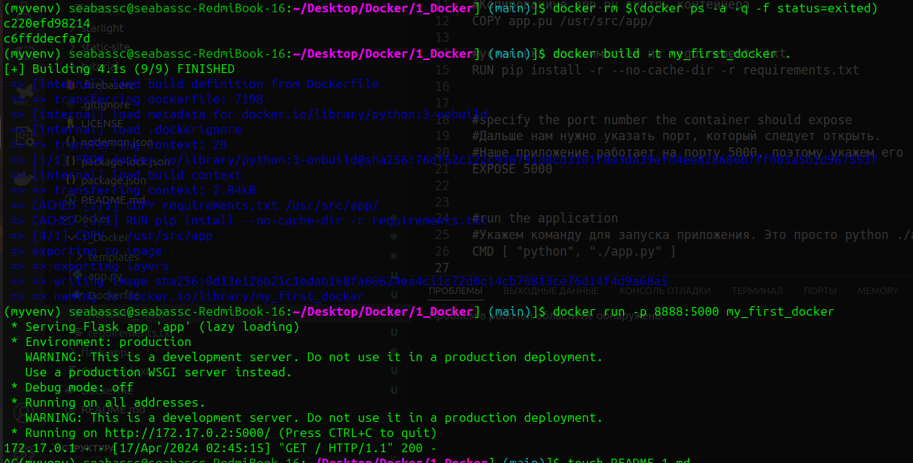

### Изучаю docker по уроку с habr
```
#our base image
#Для начала укажем базовый образ. Для этого нужно использовать ключевое слово FROM
FROM python:3.8-onbuild


# Копирование requirements.txt внутрь контейнера
COPY requirements.txt /usr/src/app/

#Копированине app.py внутрь контейнера
COPY app.pu /usr/src/app/

#установка зависимостей из requirements.txt
RUN pip install -r --no-cache-dir -r requirements.txt


#specify the port number the container should expose
#Дальше нам нужно указать порт, который следует открыть.
#Наше приложение работает на порту 5000, поэтому укажем его
EXPOSE 5000


#run the application
#Укажем команду для запуска приложения. Это просто python ./app.py. Для этого используем команду CMD
CMD [ "python", "./app.py" ]
```

 - Удалил все контейнеры которые завершили свою работу
 ```
docker rm $(docker ps -a -q -f status=exited)
 ```
 - Собрал свой контейнер
```
docker build -t my_first_docker .
```
 - Запустил
 ```
docker run -p 8888:5000 my_first_docker
 ```



> Результат    &#8595;


   

