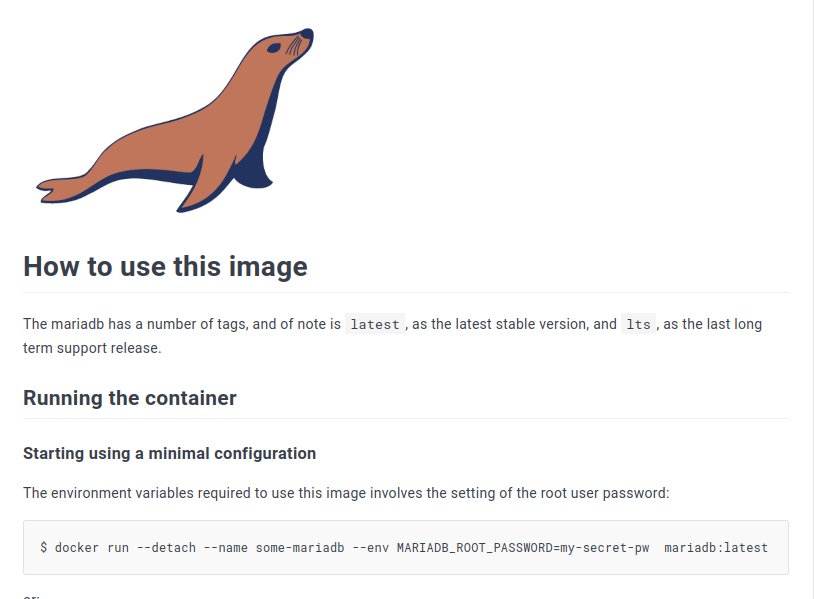

### Устанавливаю marinadb

> с офицального Docker Hub maria db смотрим инструкию по установке контейнера
```
$ docker run --detach --name some-mariadb --env MARIADB_ROOT_PASSWORD=my-secret-pw  mariadb:latest
```
>  меняем на удобное имя и устанавливаем пароль
```
docker run --detach --name mysqlserver --env MARIADB_ROOT_PASSWORD=123456  mariadb:latest
```

> после установки проверяю, работает ли контейнер

```
docker ps
```

### Устанавливаю Adminer

> с офицального Docker Hub adminer смотрим инструкию по установке контейнера
```
$ docker run --link some_database:db -p 8080:8080 adminer
```
> вместо some_database, пишем имя установленное нами, что мы и видем после выполнения командой docker ps
```
docker run --link mysqlserver:db -p 8080:8080 adminer
```
> установления соездинения определяется аргументом --link в команде docker run

### Выполняем команду и получаем результат

> перехожу по адресу localhost:8080/ ввожу пароль как устанавливал 123456

> база данных доступна