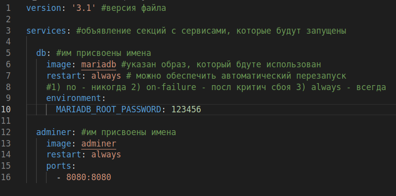
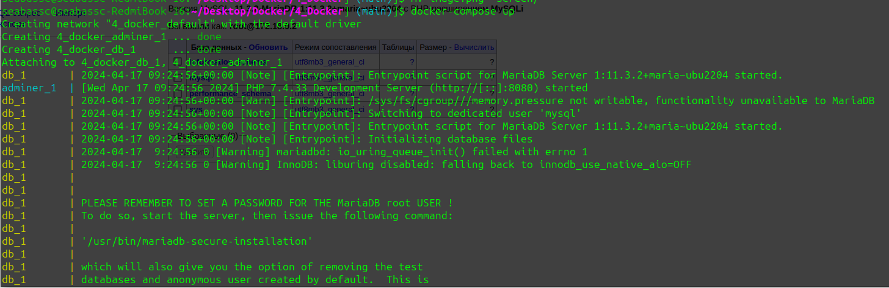
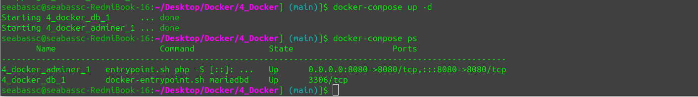
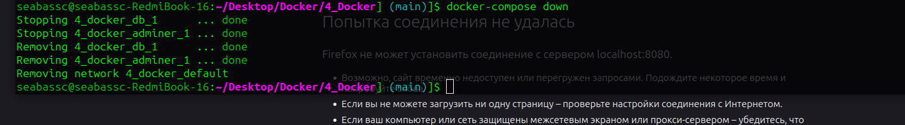

# Знакомлюсь с docker-compose
> Docker Compose - это инструмент, который позволяет определить и запускать множество контейнеров Docker как часть одного приложения. С помощью файла конфигурации YAML можно описать параметры каждого контейнера, их зависимости друг от друга, сетевые настройки и другие параметры.
Можно запустить все контейнеры одной командой, что делает управление множеством контейнеров проще и более удобным. Docker Compose также позволяет легко масштабировать приложение, изменять параметры и перезапускать контейнеры.
В общем, Docker Compose помогает легко создавать и управлять комплексными приложениями, состоящими из нескольких контейнеров Docker.


> Файл docker-compose.yml

Запускаем docker-compose, командой 
```
docker-compose up
```
Контейнер успешно собрался, все работает



Чтобы запустить это все в фоновом режиме, то добавим флаг -d
```
docker-compose up -d
```

проверяю командой, работает
```
docker-compose ps
```

> для тоо, чтобы оставить необходимо ввести команду 
```
docker-compose down
```
