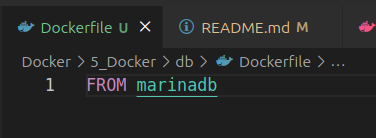
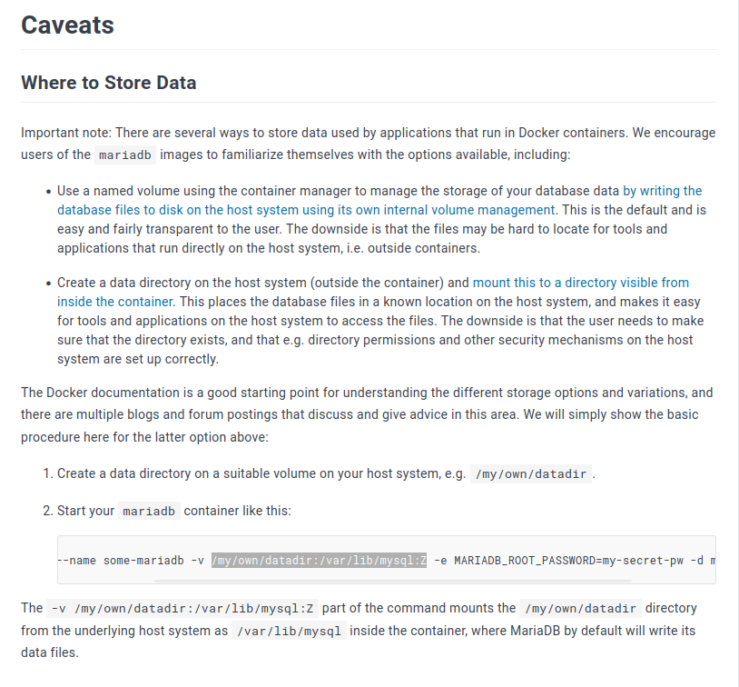
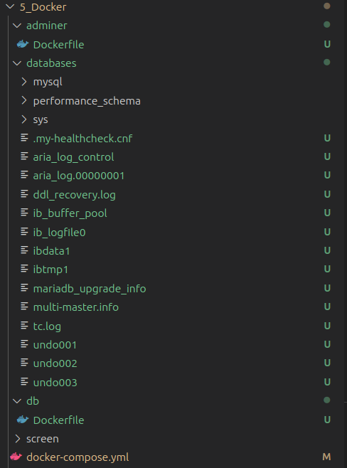

#  Docker-compose  и Dockefile для каждой сборки и локальная база данных

> создаю две папки db и adminer, указываю к ним путь через build в docker-compose.yml, в данных папках создаю Dockerfile, что позволяет собирать каждый образ с нужными правилами





> здесь указано путь в контейнере где хранится база данных
```
$ docker run --name some-mariadb -v /my/own/datadir:/var/lib/mysql:Z -e MARIADB_ROOT_PASSWORD=my-secret-pw -d mariadb:latest
```
> копирую в docker-compose
```
version: '3.1' #версия файла

services: #объявление секций с сервисами, которые будут запущены

  db: #им присвоены имена
    build: ./db #указан образ, который бдуте использован
    restart: always # можно обеспечить автоматический перезапуск 
    #1) no - никогда 2) on-failure - посл критич сбоя 3) always - всегда
    environment:
      MARIADB_ROOT_PASSWORD: 123456
    volumes:
      - ./databases:/var/lib/mysql
    #Директория_на_ПК:В_Контейнере

  adminer: #им присвоены имена
    build: ./adminer # благодаря такой реализации, можно вносить изменения в Dockerfile каждой сборки
    restart: always
    ports:
      - 8080:8080
```

> создаю директорию в проекте, где будет расположена база данных, командой
```
mkdir databases
```

Собираю контейнер
```
docker-compose up
```

> Вижу, что все данные с базой данных успешно сохранились в директории, теперь если удалю контейнер, то данные из базы данных сохранятся
